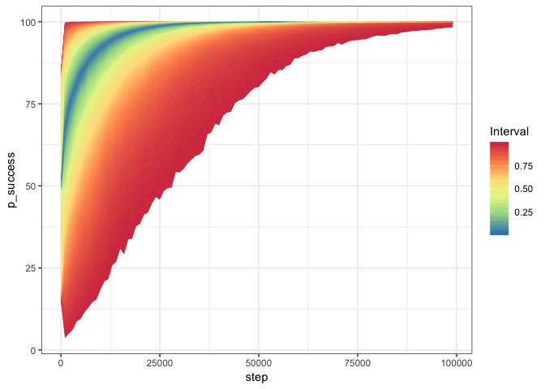
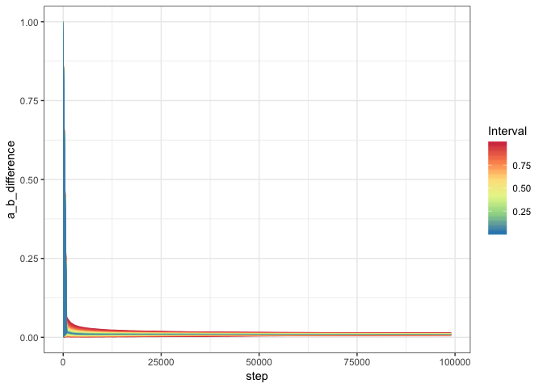
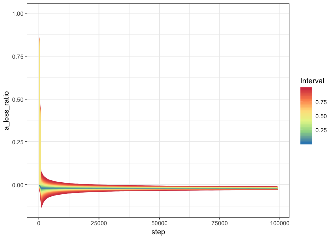

MC simulations of the convergance propertiers of the Bayes Test with Bernoulli distributions
================

Loads the data from the monte carlo simulation. The simulation was 10,000 runs of two Bernoulli distributions. A had a mean of 0.5 while B had mean of 0.49. The data simulations were run for 100,000 samples with data being checked every 1,000 samples.

``` r
early_stop_sim = read.csv("/Users/jeff/pgit/experimentation/experiments/b_early_stop_simulation_results_10000_100000.csv")
```

The following is going to construct a fan plot showing the distributions of the p\_success metric. This is the probability that A &gt; B.

``` r
library(ggplot2)
library(magrittr)
library(dplyr)
```

    ## 
    ## Attaching package: 'dplyr'

    ## The following objects are masked from 'package:stats':
    ## 
    ##     filter, lag

    ## The following objects are masked from 'package:base':
    ## 
    ##     intersect, setdiff, setequal, union

``` r
library(ggfan)

p <- ggplot(early_stop_sim, aes(x=step,y=p_success)) + geom_fan() + theme_bw() + scale_fill_distiller(palette="Spectral")
print(p)
```

 It can be seen that this metric is suseptible to early stopping issues where the wrong conclusion can be reached if the test is terminated too early.We need to find other indicators that converge more quickly leverage to terminate failed tests early.

Next lets look at the difference between A and B using the Kolmogorov-Smirnov statistic

``` r
p <- ggplot(early_stop_sim, aes(x=step,y=a_b_difference)) + geom_fan() + theme_bw() + scale_fill_distiller(palette="Spectral")
print(p)
```



It appears this converges pretty quickly to a value that may indicate similarities in the distributions of A and B.

Let's also look at A loss ratio to see if there is a signal there as well.

``` r
p <- ggplot(early_stop_sim, aes(x=step,y=a_loss_ratio)) + geom_fan() + theme_bw() + scale_fill_distiller(palette="Spectral")
print(p)
```



A loss ratio does not converge as quickly as the Kolmogorov-Smirnov statistic. However, the exact convergance properties of both metrics are still somewhat unknown. We could do simulations to understand the convergance rate for the two metrics under given distributions and given similarities.

Next we need to understand what more favaorable and less favorable situations looks like to make sure we can accuratly distinguish those so we don't accedently stop a succeeding test too early and we can correctly identify the failed test early on.
